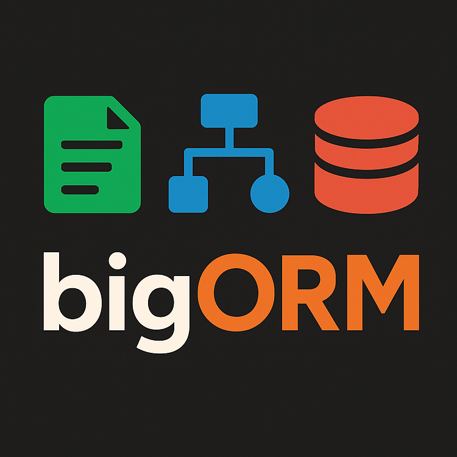

<!-- LOGO -->
<p align="center">
  
</p>

<!-- TITLE -->
<h1 align="center">BIGORM Modeling Tool</h1>

<!-- BADGES -->
<div align="center">
  
  
  
  
  
</div>

<!-- DESCRIPTION -->
<p align="center">
  <b>Open-source ORM modeling tool for VS Code supporting textual editing and graphical visualization and code generation for multiple ORM Frameworks!</b></br>
  <sub><a href="https://marketplace.visualstudio.com/items?itemName=BIGModelingTools.bigorm">➜ Download the VS Code Extension</a><sub>
</p>

<!-- DEMO -->
***todo: recreate gif for bigORM***
<p align="center">
  
</p>

<!-- FEATURES -->
**Main features:**

- 📝 **Textual Language** for the specification of ORM models in the textual editor. Assistive *validation* and *rich-text editing* support, enabled with the [Language Server Protocol](https://microsoft.github.io/language-server-protocol/), allows to quickly get familiar with the available language constructs.
- 📊 **Diagram View** that is fully synchronized with the textual model and automatically updates on changes. Also offers an interactive toolbar with *layout mechanisms*.
- 🖨️ **Code Generation** to *generate ORM code* out of the specified ORM models and integrate with existing databases. Currently support for *Hiberate*, *SQLAlchemy* and *Entity Framework*.
- ⏪ **Reverse Engineering (EXPERIMENTAL)** to *generate ORM Models* out of existing Hibernate ORM code.

## 📖 Table of Contents

1. [About the Project](#about-the-project)
2. [Instructions](#instructions)
3. [Issues](#issues)
4. [Contributing](#contributing)
5. [License](#license)

## About the Project

Entity-Relationship (ER) modeling is the de-facto standard for data modeling, offering powerful concepts to visualize data in (relational) databases. Various tools for ER modeling are available, however, often they are inflexible, proprietary, or constrained to specific platforms.

The bigER tool aims to provide an open-source and modern solution for ER by making use of the [Language Server Protocol (LSP)](https://microsoft.github.io/language-server-protocol/). The protocol is used for communicating textual language features to the VS Code client and is further extended to also support graphical editing, making it one of the first *hybrid modeling tools* based on the LSP.

### Built With

The Java-based language server is realized with [Xtext](https://www.eclipse.org/Xtext/) and [Xtend](https://www.eclipse.org/xtend/), while the diagramming capabilities are based on [Sprotty](https://github.com/eclipse/sprotty). Sprotty enhances the server with graphical language features (using [`sprotty-server`](https://github.com/eclipse/sprotty-server)) and integrates with VS Code through [Sprotty VS Code Extensions](https://github.com/eclipse/sprotty-vscode).

## Instructions

> The following section covers the instructions to build **bigORM** from scratch. Instructions how to install **bigORM** from the Visual Studio Marketplace and how to use the application can be found directly on the [Visual Studio Marketplace](https://marketplace.visualstudio.com/items?itemName=BIGModelingTools.bigorm).

### Prerequisites

- [Node.js](https://nodejs.org/en/) 20 (tested: v20.11.1)
- [Java](http://jdk.java.net/) JDK 17 (tested: 17.0.2)
- [VS Code](https://code.visualstudio.com/) v1.90 or above
- [yarn](https://yarnpkg.com/)

Download or clone the repository and in the root folder of the project execute the following commands:

```bash
language-server/gradlew -p language-server/ build 
yarn --cwd webview  
yarn --cwd extension
```

After building the project, the extension can be run in VS Code by pressing <kbd>F5</kbd> or selecting `Run ➜ Start Debugging` from the menu.

The code is split into a **client side** (extension & webview) and a **server side** (language with LSP and diagram server). It is recommended to use  **VS Code** for the client code, written in *TypeScript* and **Eclipse** for the server side, based on *Java*. Eclipse must be compatible with Xtext and Xtend (e.g. [Eclipse IDE for Java and DSL Developers](https://www.eclipse.org/downloads/packages/release/juno/sr2/eclipse-ide-java-and-dsl-developers)) and create a new workspace to avoid configuration issues. Import the language server as a Gradle project (<kbd>File -> Import -> Existing Gradle Project</kbd>) and override the workspace settings.

## Issues

Project issues are managed on GitHub, see [Open Issues](https://github.com/borkdominik/bigER2ORM/issues) for the currently tracked issues. Do not hesitate to report a bug or request a feature through the offered [Issue Templates](https://github.com/borkdominik/bigER2ORM/issues/new/choose). For questions, simply use a blank issue.

<!-- CONTRIBUTING -->
## Contributing

Contributions to the project are always welcome! See the [Contribution Guidelines](https://github.com/borkdominik/bigER2ORM/blob/main/.github/CONTRIBUTING.md) for more information.

### Contributors

- [Bernd Stainer](https://github.com/berndstainer) (main developer)
- [Dominik Bork](https://github.com/borkdominik)

See [All Contributors](https://github.com/borkdominik/bigER2ORM/graphs/contributors) for bigORM.

As **bigORM** is heavily based on [**bigER**](https://github.com/borkdominik/bigER/blob/main/README.md#contributing), we'd also like to thank the developers of said at the time of forking:

- [Philipp-Lorenz Glaser](https://github.com/plglaser) (main developer)
- [Georg Hammerschmied](https://github.com/SchmiedHammer) (multi-notation support)
- [Hnatiuk Vladyslav](https://github.com/Aksem) (improved edge router)
- [Christoph Lauscher](https://github.com/christoph-lauscher) (SQL import/export)
- [Dominik Bork](https://github.com/borkdominik)

If you like our work, please feel free to [buy us a coffee](https://www.buymeacoffee.com/bigERtool) ☕️

<a href="https://www.buymeacoffee.com/bigERtool" target="_blank">
  
</a>

## License

The project is distributed under the MIT License. See [License](https://github.com/borkdominik/bigER2ORM/blob/main/LICENSE) for more details.
